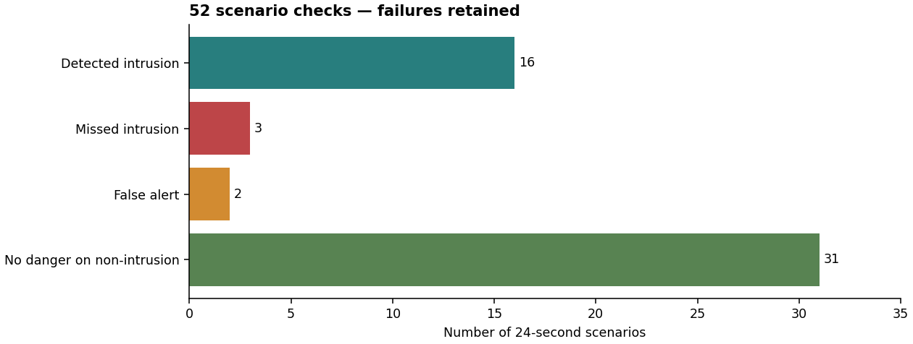

# Multimodal night security - simulation study

A college ECE prototype for detecting unusual activity in a quiet restricted room. A PC processes audio and camera frames; an Arduino reads PIR, ultrasonic range and a radar presence output. The decision is automatic. A simulated receiver gets an alert when correlated evidence reaches RED.

**Status: an executed simulation and compiled Arduino sketch, not a physically validated security installation. All modules live in this repository; development and testing are currently simulation-only.**

## What was measured

| Check | Result |
|---|---|
| Synthetic scenarios | 52 scenarios, repeated with 10 independent noise seeds: 520 trials |
| Intrusion trials | 160 detected / 190; 30 missed |
| Non-intrusion trials | 20 false alerts / 330 |
| Naive any-input alarm | 170 false alerts / 330 on the same generated inputs |
| Real audio | 40 ESC-50 clips: 6 train, 4 calibration, 30 evaluation |
| Real footstep clips | All 3 missed by the broad real-background proxy model |
| Embedded replay | 12,480 sensor ticks; C++ and Python outputs agreed |
| UNO R4 WiFi build | Compiled using official Renesas UNO core 1.6.0 |
| MATLAB execution | NOT RUN: MATLAB is unavailable in the execution environment |
| Physical sensors / HP performance | NOT TESTED |



The repeated cases share the same event shapes and schedules; ten noise seeds do not turn them into ten independent real-world trials. These are engineering checks, not a claimed security accuracy.

## Run online

[Open the project notebook in Google Colab](https://colab.research.google.com/github/konark-icdesign/complex-embedded-iot-based-security-system/blob/main/notebooks/run_project.ipynb). Run its cells in order on a CPU runtime. It downloads the public audio subset, checks the modules, then runs the integrated simulation. The notebook is syntax-checked; a hosted Colab run has not been verified. No MATLAB execution or physical-board validation is implied.

## Run the executed reference

Use Python 3.12 or a compatible newer installation. From this directory:

```text
python -m venv .venv
.venv\Scripts\activate
python -m pip install -r requirements.txt
python scripts/fetch_real_audio.py
python run_simulation.py --seeds 10
python -m unittest discover -s tests -p "test_*.py" -v
```

On Linux/macOS, activate with `source .venv/bin/activate`. Text results are included. The first real-audio download needs a network connection; later runs use the cached clips. Generated plots, media and MATLAB fixtures are rebuilt by the simulation. The command overwrites derived results. One seed is enough for a quick demonstration: `python run_simulation.py --seeds 1`.

## One project, staged validation

The shared `src/` modules implement audio DSP, camera processing, physical sensor filtering, evidence fusion and the durable mock alert receiver. `run_simulation.py` exercises these together. `firmware/` contains the Arduino C++ implementation, and `matlab/` contains the independent MATLAB reference. This is integrated offline validation, not a finished live hardware installation.

The quiet-room assumption (steady PC-like background, possible thunder) also has a focused experiment:

```text
cd experiments/audio_room
python run_audio.py
python -m unittest test_audio -v
```

It imports the shared DSP implementation. Its results are separate from the broader 52-scenario stress suite: 10/10 soft-footstep trials were missed. Thunder can raise audio suspicion but cannot cause a danger alert alone. Neither background generator is a recording of the user's room.

An invalid-frame persistence bug is corrected in both Python and MATLAB. Python regression coverage checks that invalid audio cannot inherit an anomaly flag; MATLAB remains unexecuted.

## MATLAB

First run the Python simulation above to generate `fixtures/matlab_reference.mat` and the replay traces. Then open the project folder in MATLAB and run:

```matlab
addpath('matlab');
run_full_simulation
```

Base MATLAB code independently computes FFT features, baseline statistics, illumination compensation, plots and central fusion. It checks raw audio/image kernels and replays all 52 fusion traces. It is **not yet executed or certified equivalent**. A successful future MATLAB run writes its own log under `results/matlab/`; do not replace the current NOT RUN label before that happens. No DSP, Computer Vision or Statistics toolbox is required for this offline code.

## Arduino

Open `firmware/night_security/night_security.ino` in Arduino IDE 2. Install **Arduino UNO R4 Boards**, select **Arduino UNO R4 WiFi**, and compile. The board has a 60-second warm-up, bounded sensor polling, input filters, a watchdog, a heartbeat timeout and a latched local alarm. Wiring and limits are in `docs/hardware.md`.

For native logic checks with GCC:

```text
make embedded
make sanitize
python scripts/verify_embedded_replay.py
```

The hosted test environment requires `ASAN_OPTIONS=detect_leaks=0` because LeakSanitizer cannot run under its process tracing. The replay script provides `--no-leak-check` for that environment. AddressSanitizer and UndefinedBehaviorSanitizer were still executed. On an ordinary supported machine, leave leak detection enabled. Vendor core warnings from the board build are retained in its log; our host-side code compiled with `-Wall -Wextra -Werror -Wpedantic`.

To reproduce the exact numerical package versions, use `requirements-tested.txt` instead of the broader compatible version ranges. To rebuild the PDF from results, install `requirements-report.txt` and run `python scripts/build_report.py`.

## Read in this order

1. `docs/architecture.md` - what the system actually decides and changes to the brief.
2. `docs/dsp_maths.md` - the mathematics and small worked examples.
3. `docs/hp_setup.md` - software and conservative settings for an 8 GB HP.
4. `docs/hardware.md` - pin mapping, power and bench procedure.
5. `docs/learning_and_validation.md` - explain the code, collect real data, and decide the next version.
6. `docs/experiment_report.md` - generated tables, measured failures and execution boundaries.

## Limits that matter

This version cannot identify a person, distinguish intent, guarantee detection in darkness, infer real weather, or guarantee zero false alarms. A heated moving object can trigger multiple sensors. Poor placement can make outside activity look like entry. Audio models trained on unrelated rooms or broad sound categories transfer poorly.

Only a local SQLite notification receiver is implemented and tested. No security team is contacted. Continuous physical acquisition, real notification transport, clock synchronization, power-loss recovery on the board, and room calibration remain integration work. `matlab/serial_bench.m` is an I/O inspection utility, not a finished live server.

## Data and sources

ESC-50: K. J. Piczak, *ESC: Dataset for Environmental Sound Classification*, ACM Multimedia 2015. Official dataset: https://github.com/karolpiczak/ESC-50 . Its CC BY-NC terms and original recording attributions are retained in `fixtures/esc50/LICENSE`. Do not relicense the bundled audio as project code. File hashes, source URLs and selected folds are in `fixtures/esc50/manifest.json`.

The code and figures are a transparent development artifact. Keep test logs, label simulations, and make your own measured changes before presenting it as work you understand. Full source links are in `docs/sources.md`.
